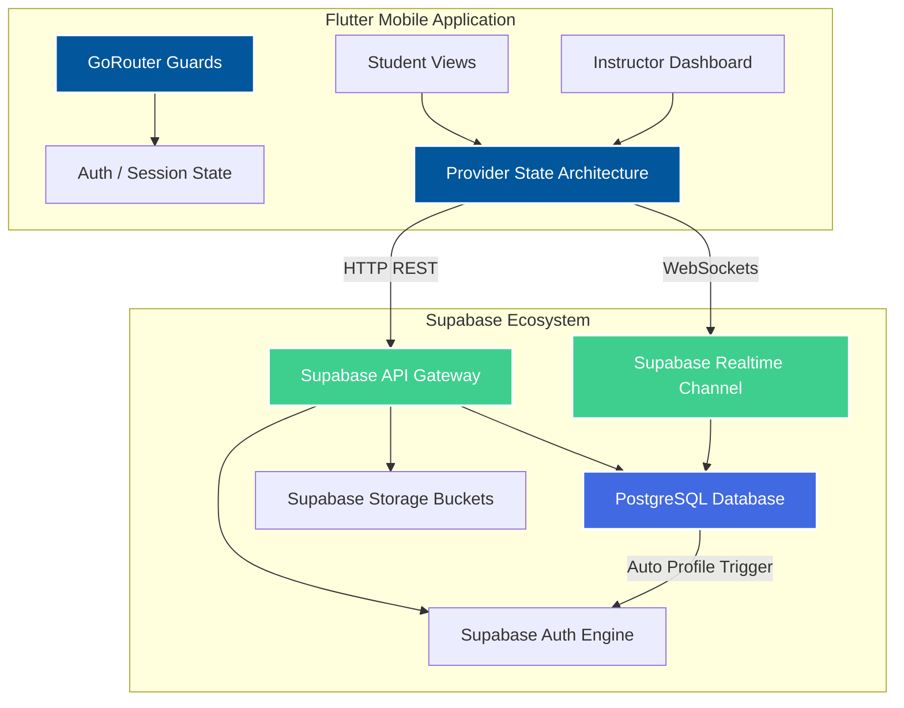

# 🏄‍♂️🌊 HikkaSurf - Surf Lesson Booking & Instructor Marketplace

[](https://flutter.dev)
[](https://supabase.com)
[](https://www.postgresql.org)

**HikkaSurf** is a peer-to-peer mobile marketplace designed to connect surf students directly with local instructors in Hikkaduwa, Sri Lanka. By removing third-party agencies, the platform provides a streamlined experience for lesson booking, automated availability scheduling, and real-time session updates.

---

## 📸 UI Screenshots & Demo

### 📱 Marketplace & Schedule Management
<table align="center">
  <tr>
    <td align="center" width="25%">
      
      <br><sub><b>1. Instructor Discovery</b></sub>
    </td>
    <td align="center" width="25%">
      
      <br><sub><b>2. Interactive Booking</b></sub>
    </td>
    <td align="center" width="25%">
      
      <br><sub><b>3. Instructor Dashboard</b></sub>
    </td>
    <td align="center" width="25%">
      
      <br><sub><b>4. Live Notifications</b></sub>
    </td>
  </tr>
</table>

---

## ✨ Core Features

### 🧑‍🎓 Student Experience
- **Smart Discovery:** Browse and filter local surf instructors by ratings, location, surf styles, and language proficiencies.
- **Seamless Booking:** Select target dates, specific time slots, duration, and surf experience levels with instant summary creation.
- **Live Status Tracking:** Monitor booking requests in real-time as they transition from *Pending* to *Confirmed* or *Cancelled*.
- **Community Reviews:** Write and submit detailed session reviews to maintain marketplace trust.

### 🏄‍♂️ Instructor Management
- **Analytics Dashboard:** Get a bird's-eye view of daily sessions, total earnings/stats, pending requests, and cumulative ratings.
- **Hybrid Availability Engine:** Manage recurring weekly availability calendars alongside single-date overrides (blocking or opening specific slots dynamically).
- **Profile Customization:** Showcase certifications, languages, serving areas, and media directly to potential clients.

---

## 💡 Technical Highlights & Engineering

### 1. Hybrid Scheduling Logic
To prevent overbooking while offering flexibility, the scheduling engine combines **recurring weekly slots with granular date-specific overrides**. Instructors can set a standard pattern (e.g., Every Monday 9 AM - 11 AM) but easily block off a specific date if they are unavailable, handled via a optimized query layer.

### 2. Live WebSocket Syncing
Instead of resource-heavy polling, the app utilizes **Supabase Realtime Channels**. By subscribing directly to PostgreSQL `INSERT` and `UPDATE` events, booking confirmations and alerts are pushed instantly to the client device over persistent WebSockets.

### 3. Role-Aware Security & Routing
Navigation is guarded using **GoRouter with asynchronous redirection blocks**. Upon authentication, user roles are evaluated server-side, routing students to the discovery engine and instructors straight to their management dashboard, preventing unauthorized view access.

---

## 🛠️ System Architecture



---

## 🚀 Tech Stack Matrix

| Category | Technology | Operational Implementation |
| --- | --- | --- |
| **Mobile Framework** | Flutter & Dart | Cross-platform UI compilation for target iOS & Android devices |
| **Backend-as-a-Service** | Supabase | Core identity management, real-time channels, and storage orchestration |
| **Database** | PostgreSQL | Relational schema holding profiles, bookings, overrides, and logs |
| **State Management** | Provider | Dedicated ChangeNotifier structures (7 key domains decoupled from UI) |
| **Navigation** | GoRouter | Decoupled declarative routing framework with role-aware blocks |
| **Media Handling** | Supabase Storage / Image Picker | Profile picture transformations with persistent upsert pipelines |
| **UX Polish** | Shimmer / Cached Network Image | Image caching architectures paired with loading skeletons |

---

## 📂 Structural Breakdown

```
HikkaSurf/
├── lib/
│   ├── core/         # Routing configurations, theme rules, and network constants
│   ├── models/       # PostgREST data mapping schemas (Profile, Booking, Review)
│   ├── providers/    # Domain-isolated state engines (Auth, Booking, Availability)
│   ├── services/     # Low-level Supabase wrappers and hardware interactions
│   └── views/        # Shared widgets, student workflows, and instructor dashboards
├── assets/           # Secure font profiles and branding assets
└── pubspec.yaml      # Native package tree definitions

```

---

## ⚙️ Development Environment Setup

### 1. Prerequisites

Ensure you have the Flutter SDK configured on your workstation:

```bash
flutter doctor

```

### 2. Dependency Ingestion

Clone the repository, navigate into the project context, and fetch dependencies:

```bash
cd HikkaSurf
flutter pub get

```

### 3. Environment Variable Injection

Create an environment file or update your configuration properties to point to your Supabase infrastructure instance:

```env
SUPABASE_URL=[https://your-project-id.supabase.co](https://your-project-id.supabase.co)
SUPABASE_ANON_KEY=your-anonymous-public-key

```

### 4. Compilation & Launch

Execute the target build command on your active mobile simulator or connected physical device:

```bash
flutter run

```

---

## 👥 Project Metadata

* **Type:** Individual Project
* **Timeline:** Jun. 2025 – Dec. 2025
* **Target Platforms:** Android & iOS (Cross-Platform)

